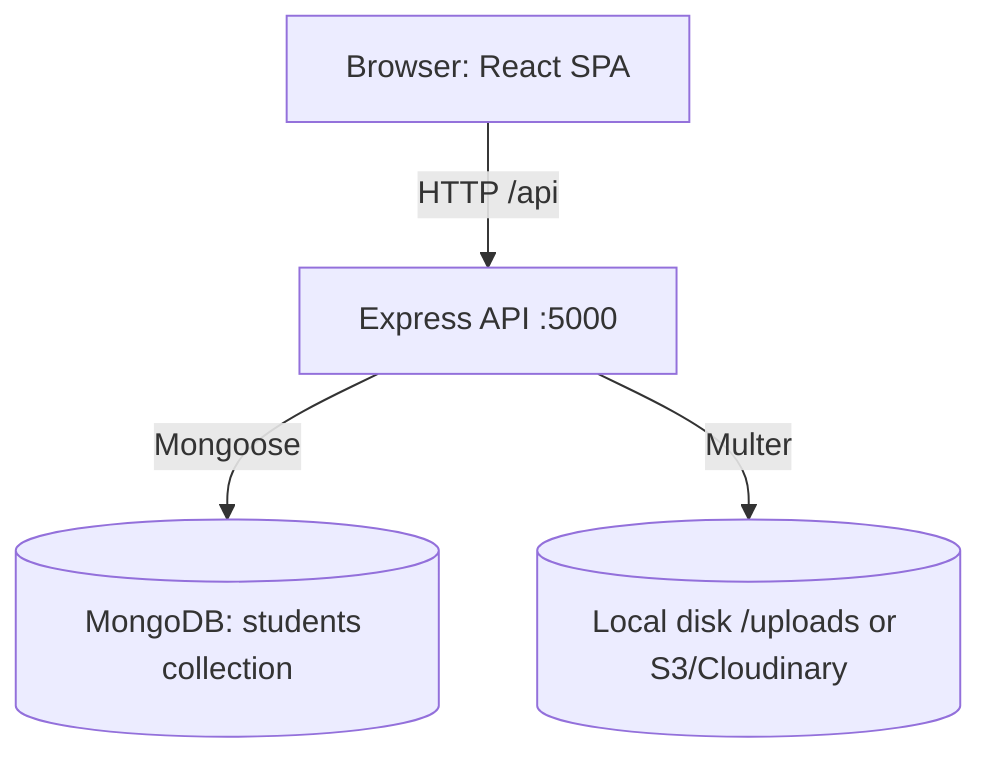

# 🎓 Student Management System (MERN Stack)

## Live Demo 
[https://3.108.217.136](http://3.108.217.136)

[](https://nodejs.org/)
[](https://expressjs.com/)
[](https://www.mongodb.com/)
[](https://react.dev/)
[](LICENSE)

A full-stack **Student Management System** built on the MERN stack (MongoDB, Express, React, Node.js) — REST API backend + a working React (Vite) frontend for full CRUD, search, filter, sort, pagination, and profile image uploads. This is the MERN rewrite of the original AWS-serverless version of this project — same feature set, same clean architecture principles, different (self-hosted) stack.

---

## 📌 Table of Contents

- [Features](#-features)
- [Tech Stack](#-tech-stack)
- [Architecture](#-architecture)
- [Project Structure](#-project-structure)
- [API Endpoints](#-api-endpoints)
- [Getting Started](#-getting-started)
- [Docker](#-docker-one-command-setup)
- [Testing](#-testing)
- [Deployment](#-deployment)
- [Security](#-security)
- [Future Improvements](#-future-improvements)
- [Known Limitations](#-known-limitations)
- [License](#-license)

---

## ✨ Features

- Full **CRUD REST API** for student records
- **React frontend** — list/grid view, create/edit form, detail view, delete with confirmation
- **Search** by name, **filter** by course/semester/department/gender, **sort**, and **pagination**
- **Profile image upload** (multipart/form-data via Multer)
- Duplicate email prevention (pre-check + unique DB index)
- Standard API response envelope: `status`, `message`, `data`, `timestamp`, `requestId`
- **Structured JSON logging** (Winston) with per-request duration
- Centralised error handling (Mongoose validation / duplicate key / cast errors mapped to correct HTTP codes)
- **Rate limiting** + **Helmet** security headers + **CORS** configured
- **Docker Compose** setup (MongoDB + backend + frontend in one command)
- Integration tests (Jest + Supertest + in-memory MongoDB)
- Postman collection with success + error-path requests for every endpoint

---

## 🧰 Tech Stack

| Layer | Technology |
|---|---|
| Frontend | React 18, React Router, Axios, Vite |
| Backend | Node.js 20, Express 4 |
| Database | MongoDB (Mongoose ODM) |
| File Uploads | Multer (local disk storage; S3/Cloudinary-ready) |
| Logging | Winston (structured JSON logs) |
| Security | Helmet, express-rate-limit, CORS |
| Testing | Jest, Supertest, mongodb-memory-server |
| Containerization | Docker, Docker Compose |

---

## 🏗 Architecture



Full architecture, request-lifecycle, sequence, and deployment diagrams: **[docs/ARCHITECTURE.md](docs/ARCHITECTURE.md)**

## 📁 Project Structure

```
Student-Management-System-MERN/
├── README.md
├── LICENSE
├── .gitignore
├── docker-compose.yml
│
├── backend/
│   ├── server.js               # Entry point - connects DB, starts server
│   ├── app.js                  # Express app setup (middleware, routes)
│   ├── package.json
│   ├── .env.example
│   ├── Dockerfile
│   ├── config/
│   │   └── db.js               # MongoDB connection
│   ├── models/
│   │   └── Student.js          # Mongoose schema
│   ├── controllers/
│   │   └── studentController.js
│   ├── routes/
│   │   └── studentRoutes.js
│   ├── middleware/
│   │   ├── validator.js        # Input validation & sanitization
│   │   ├── upload.js           # Multer profile-image upload
│   │   ├── errorHandler.js     # Centralised error handling
│   │   ├── asyncHandler.js
│   │   ├── requestId.js
│   │   └── requestLogger.js
│   ├── utils/
│   │   ├── response.js         # Standard response envelope
│   │   ├── apiFeatures.js      # Search/filter/sort/paginate
│   │   └── logger.js           # Winston structured logger
│   └── tests/
│       └── student.test.js
│
├── frontend/
│   ├── package.json
│   ├── vite.config.js
│   ├── Dockerfile
│   ├── nginx.conf
│   └── src/
│       ├── main.jsx
│       ├── App.jsx
│       ├── api/studentApi.js
│       ├── components/         # StudentCard, Pagination, SearchFilterBar, Toast
│       ├── pages/               # StudentListPage, StudentFormPage, StudentDetailsPage
│       └── styles/index.css
│
├── postman/
│   └── Student-Management-System-MERN.postman_collection.json
└── docs/
    ├── API_DOCUMENTATION.md
    └── DEPLOYMENT_GUIDE.md
```

---

## 🔌 API Endpoints

| Method | Path | Description |
|---|---|---|
| `POST` | `/api/students` | Create a new student |
| `GET` | `/api/students` | List students (search/filter/sort/paginate) |
| `GET` | `/api/students/:studentId` | Get a single student |
| `PUT` | `/api/students/:studentId` | Update a student (partial) |
| `DELETE` | `/api/students/:studentId` | Delete a student |
| `POST` | `/api/students/:studentId/profile-image` | Upload profile image |
| `GET` | `/health` | Health check |

Full docs + `curl` examples: **[docs/API_DOCUMENTATION.md](docs/API_DOCUMENTATION.md)**
Postman collection: **[postman/Student-Management-System-MERN.postman_collection.json](postman/Student-Management-System-MERN.postman_collection.json)**

---

## 🚀 Getting Started

### Prerequisites
- Node.js 20+
- MongoDB (local install, Docker, or a free [MongoDB Atlas](https://www.mongodb.com/cloud/atlas) cluster)

### 1. Backend

```bash
cd backend
cp .env.example .env
# edit .env and set MONGODB_URI
npm install
npm run dev
```
Backend runs at **http://localhost:5000**.

### 2. Frontend

```bash
cd frontend
npm install
npm run dev
```
Frontend runs at **http://localhost:5173** and automatically proxies API calls to the backend (see `vite.config.js`).

Open **http://localhost:5173** in your browser — you should see the Student Management UI.

---

## 🐳 Docker (one-command setup)

```bash
docker compose up --build
```

Spins up MongoDB + backend (port 5000) + frontend (port 5173) together — no local Node/Mongo installation needed. See **[docs/DEPLOYMENT_GUIDE.md](docs/DEPLOYMENT_GUIDE.md)** for full details and cloud deployment options (Render + Vercel + Atlas).

---

## 🧪 Testing

```bash
cd backend
npm test
```

Runs Jest + Supertest integration tests against an in-memory MongoDB instance (`mongodb-memory-server`) — no real database needed, works in CI out of the box.

---

## ☁️ Deployment

Full guide (local, Docker Compose, and cloud — Render + Vercel + MongoDB Atlas): **[docs/DEPLOYMENT_GUIDE.md](docs/DEPLOYMENT_GUIDE.md)**

---

## 🔒 Security

- All input is whitelisted and validated before touching the database (`middleware/validator.js`) — prevents NoSQL operator injection via unexpected body fields.
- Mongoose schema validation is a second line of defence.
- `email` has a unique index at the database layer.
- Helmet sets secure HTTP headers; `express-rate-limit` throttles abusive traffic.
- CORS is explicitly scoped via `CORS_ALLOW_ORIGIN`, not left wide open by accident in production.
- Uploaded files are restricted by MIME type (JPEG/PNG/WEBP/GIF) and size (5 MB max).
- No secrets are hardcoded — everything is environment-variable driven via `.env`.

---

## 🔮 Future Improvements

- JWT Authentication + role-based access control (Admin vs Student)
- CSV export/import and bulk upload
- Soft-delete + audit log collection instead of hard deletes
- Email notifications (Nodemailer / SendGrid) on create/update
- Swap local disk uploads for S3/Cloudinary for stateless, horizontally-scalable deployments
- Full-text search via MongoDB Atlas Search or Elasticsearch at scale
- CI/CD pipeline (GitHub Actions) for automated test + deploy

---

## ⚠️ Known Limitations

- No authentication is implemented in the base project — the API is open as shipped. Add JWT/Cognito-style auth before exposing this publicly with real student data.
- Profile images are stored on local disk by default — fine for local dev/Docker, but won't persist across redeploys on ephemeral hosts (Render/Heroku) unless you switch to S3/Cloudinary.
- Delete is a hard delete; there is no recovery/undo.

---

## 📄 License

MIT — see [LICENSE](LICENSE).
