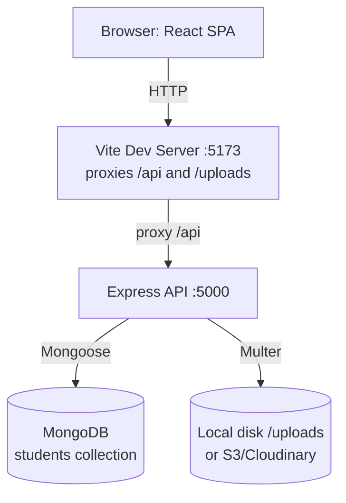
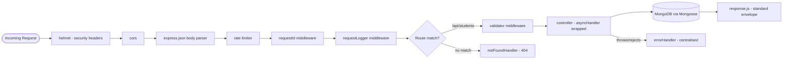
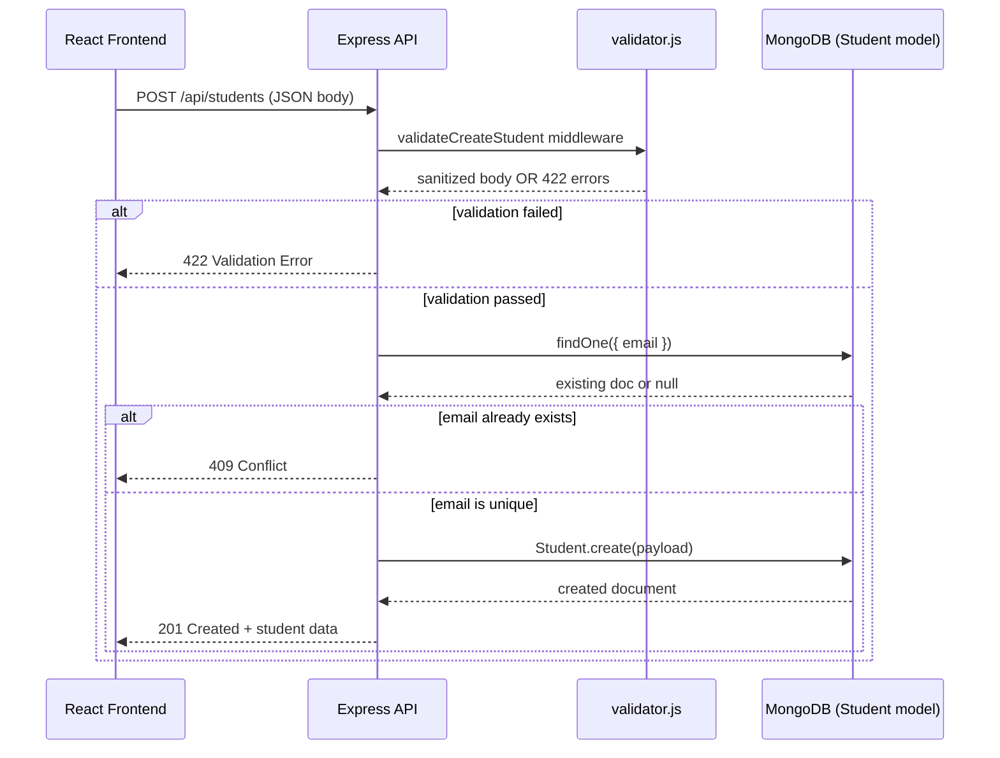
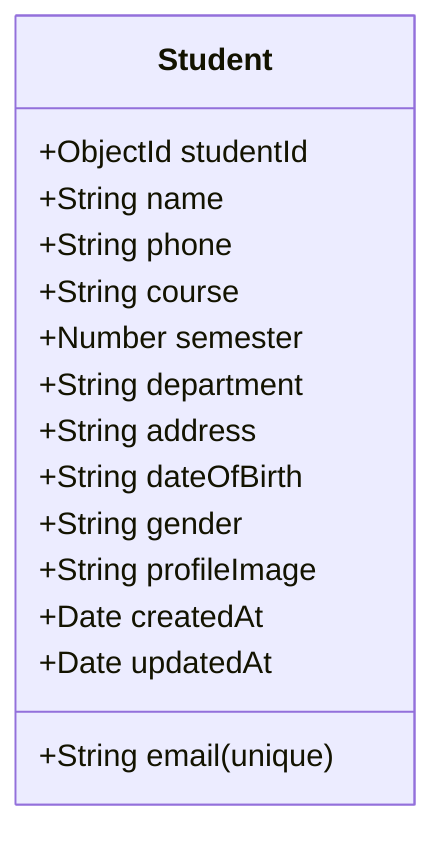
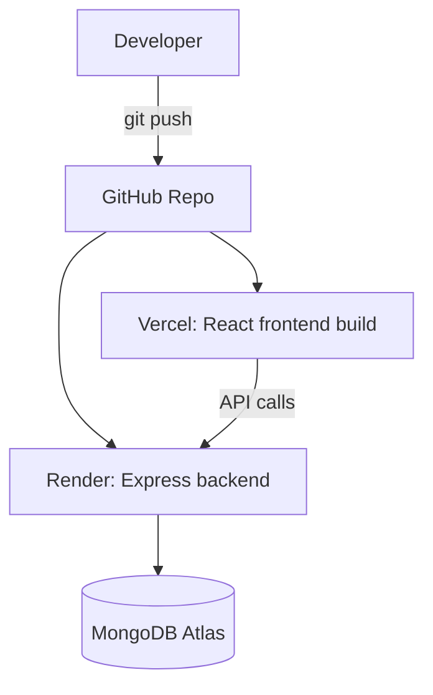

# Architecture

## System Overview

In production (Docker/cloud), the React app is built to static files and served by nginx (or Vercel/Netlify), which proxies `/api` and `/uploads` requests to the Express backend directly — the Vite dev-server proxy is only used in local development.

## Request Lifecycle (Express Middleware Chain)

## Sequence Diagram — Create Student

## Data Model

## Why MongoDB/Mongoose Here

- **Schema-level validation** (`models/Student.js`) acts as the authoritative last line of defence, on top of the `middleware/validator.js` pre-check — so data integrity holds even if a future code path bypasses the middleware.
- **Unique index on `email`** enforces the "no duplicate email" rule atomically at the database layer, closing the tiny race-condition window that a pure application-level check alone would leave open.
- **Indexes** on `course+createdAt`, `semester+createdAt`, and `createdAt` keep the `GET /api/students` filter/sort queries efficient without needing to scan the whole collection as the dataset grows.
- **ObjectId as studentId** — Mongo's built-in unique identifier, no extra UUID generation/library needed.

## Deployment Diagram

